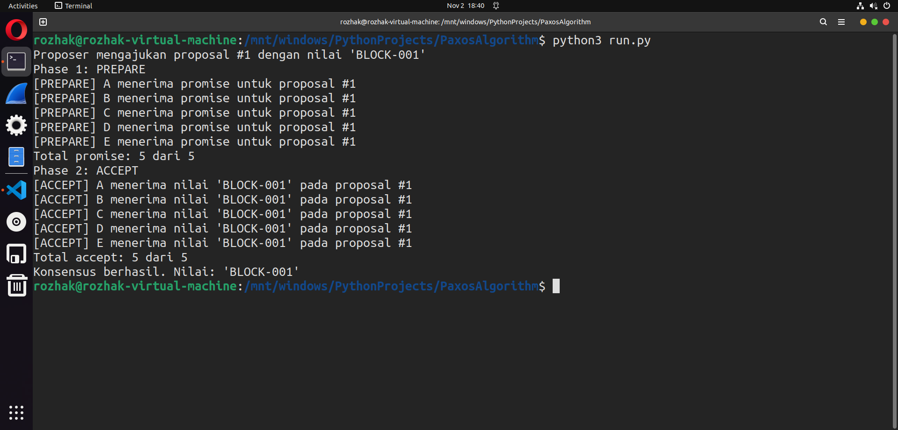
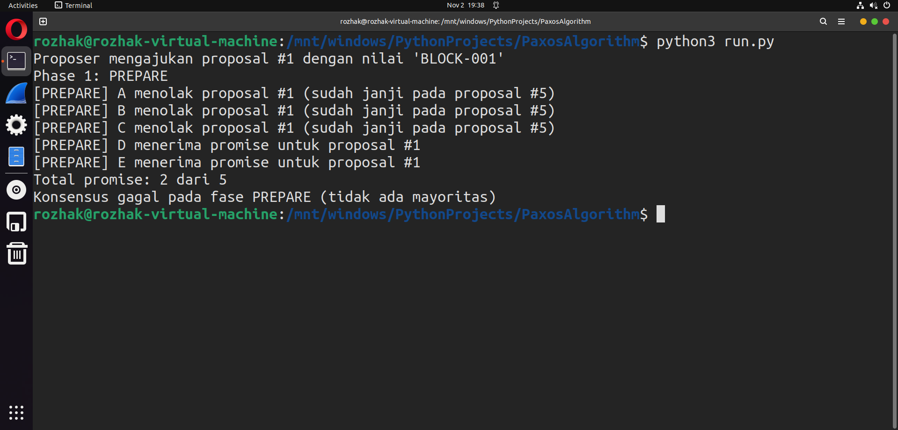

# Paxos Consensus Simulator

Simulasi edukatif algoritma konsensus **Paxos** dalam Python. Proyek ini menggambarkan bagaimana sistem terdistribusi mencapai kesepakatan (consensus) atas satu nilai meskipun terjadi kegagalan parsial, melalui dua fase utama: **PREPARE** dan **ACCEPT**.

| Skenario Berhasil | Skenario Gagal |
|------------------|----------------|
|  |  |

## Tentang Paxos

Paxos adalah algoritma konsensus klasik yang menjamin **safety** (hanya satu nilai yang dipilih) dalam sistem terdistribusi asinkron. Implementasi ini mencakup dua peran utama:

- **Proposer**: Mengusulkan nilai dengan nomor proposal unik.
- **Acceptor**: Memberikan *promise* dan menerima nilai berdasarkan aturan Paxos.

> Catatan: Peran *Learner* tidak diimplementasikan secara eksplisit dalam simulasi ini, karena fokus utama adalah pada mekanisme konsensus antara proposer dan acceptor.

## Cara Menjalankan

Pastikan Anda menggunakan Python 3.9+.

```bash
git clone https://github.com/Rozhak/paxos-consensus-sim.git
cd paxos-consensus-sim
python main.py
```

Output akan menampilkan log interaksi antara proposer dan acceptor, serta apakah konsensus berhasil atau gagal.

## Skenario yang Diilustrasikan

- **`assets/skenario_berhasil.png`**: Konsensus berhasil — mayoritas acceptor memberikan *promise* dan menerima nilai.
- **`assets/skenario_gagal.png`**: Konsensus gagal — kurang dari mayoritas acceptor merespons, sehingga tidak ada nilai yang dipilih.

## Lisensi

Proyek ini menggunakan [MIT License](LICENSE) yang memberikan izin penggunaan dan modifikasi secara bebas.

## 

Dibuat untuk tujuan pembelajaran — bukan untuk produksi.